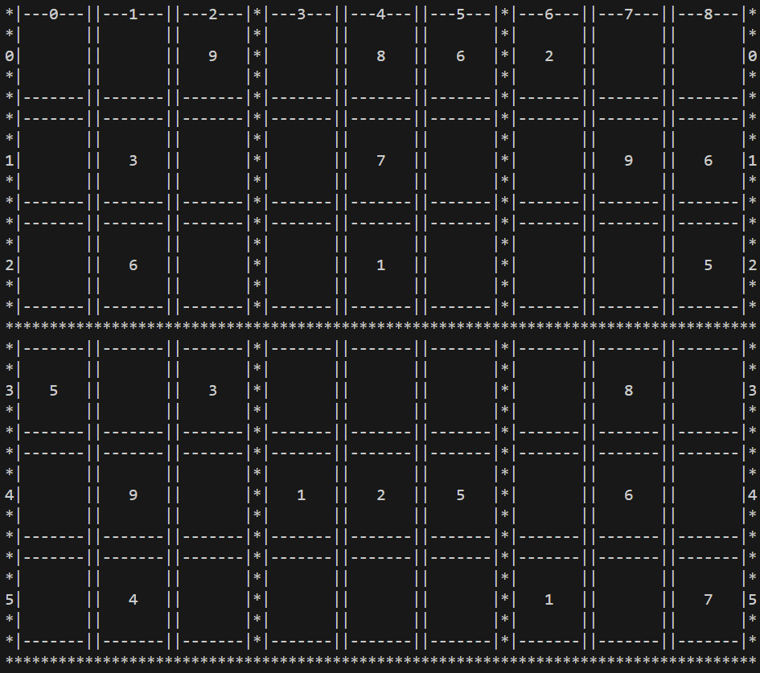
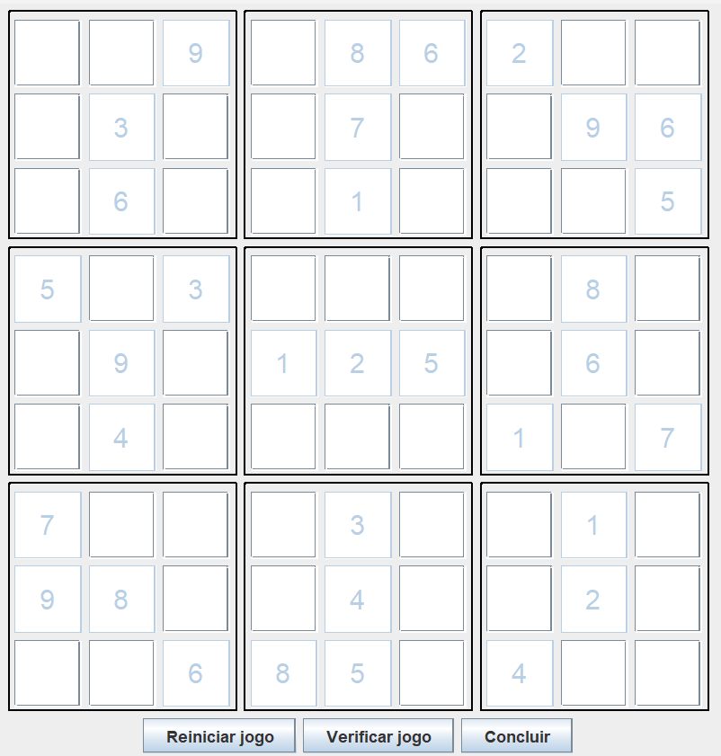

# Criando um Jogo do Sudoku em Java

O objetivo desse desafio foi replicar um jogo de sudoku de terminal e de interface gráfica.

Foi proposto para adicionar uma função de rascunho, mas eu não fiz.

## Terminal

## Interface gráfica

